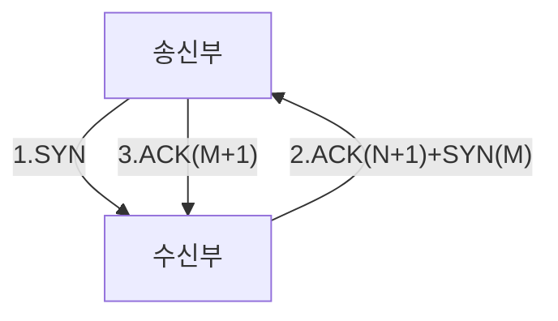
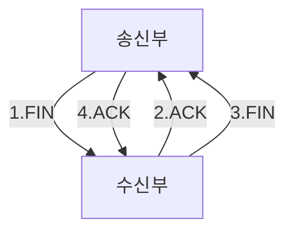

# 네트워크 계층
## OSI 7계층
- 국제 표준화 기구에서 네트워크 통신이 이뤄지는 과정을 7단계로 나눈 네트워크 표준 모델
- 데이터를 송신할때는 높은계층 -> 낮은 계층 전달. 데이터 수신부의 가장 낮은계층에 도착하면 높은계층으로 데이터 전달
- 각 계층은 독립적이며 데이터 송신 시 각 계층에 필요한 정보를 추가해 데이터를 가공함.
- 데이터 캡슐화
	- 데이터 송신 시 제어정보를 담은 헤더(데이터 앞에 붙음)나 트레일러(데이터 뒤에 붙음)가 붙음.
	- 수신부의 같은 계층에서 데이터 호환성을 높이고 오류의 영향을 최소화하고자함
	
	
	1. 송신부에서 데이터 캡슐화를 마친 결과물을 수신부로 보냄.
	2. 수신부는 물리계층부터 응용계층까지 거치며 받은 데이터에서 헤더와 트레일러를 분석해 제거하는 역캡술화를 진행 - 각 계층은 필요한 제어정보를 얻음
	- 포로토콜: <mark class="hltr-cyan">데이터를 송수신하기 위해 정한 규칙</mark>
	- 7계층(응용계층): HTTP, FTP 등의 프로토콜을 응용 프로그램의 UI에 제공
	- 6계층(표현계층): 데이터를 표준화한 형식으로 변경
	- 5계층(세션계층): 세션의 유지/해제 등 응용 프로그램 간 통신제어, 동기화
	- 4계층(전송계층): 신뢰성있는 데이터 전달을 위한 계층. TCP, UDP같은 전송방식과 포트번호를 결정
	- 3계층(네트워크 계층): 데이터 송신부에서 수신부까지 보내기 위한 최적의 경로를 선택하는 라우팅 수행. 선택한 최적경로를 라이트라고함. 네트워크 계츠으이 장비로는 라우터가 있음
	- 2계층(데이터계층): 데이터흐름을 관리하여 데이터의 오류 검출 및 복구등을 수행. 브리지, 스위치, 이더넷이 데이터계층의 장비임
	- 1계층(물리계층): 데이터를 비트단위의 0과1로 변환한 후 장비를 사용해 전송하거나 전기신호로 데아터 복원. 리피터, 허브 등이 물리계층에 해당하는 장비

## TCP/IP 4계층
- TCP/IP: <mark class="hltr-cyan">인터넷에서 데이터를 주고받기위한 네트워크 프로토콜</mark>
- TCP: 데이터를 나눈 단위인 패킷의 전달여부와 전송순서를 보장하는 통신방식
- IP:  패킷을 빠르게 내보내기 위한 통신방식
- 대표적으로 HTTP가 있음
- TCP/IP 4계층: TCPTCP/IP에 맞춰 네트워크 통신 표준인 OSI 7계층을 단순화한것

- 4계층(응용계층): 사용자와 소프트웨어를 연결해주는 계층. HTTP, HTTPS, DNS 등의 프로토콜이 작동
- 3계층(전송계층): 데이터의 신뢰성을 보장. 포트번호로 데이터를 적절한 응용 프로그램에 전달함. TCP, UDP등의 포로토콜이 여기속함. 데이터 단위는 세그먼트
- 2계층(인터넷계층): 데이터를 최종목적지 까지 도달할 수 있게 하는 계층. IP가 대표적인 프로토콜. 
	- 패킷(데이터그램): 전송계층으로부터 받은 데이터에 헤더를 붙여 캡슐화. 네트워크에서 주고받는 데이터를 작게 분할한 단위. 데이터의 송신주소, 수신주소 등의 정보가 포함되어 목적지로 전달가능함
- 1계층(네트워크 인터페이스 계층): 네트워크 접근 계층. 데이터를 전기 신호로 변환하고 MAC주소(48비트로 구성된 하드웨어 고유의 주소)를 사용해 기기에 데이터를 전달. 이더넷, Wi-Fi 등이 대표적인 프로토콜임

---
# TCP와 UDP
전송계층에서 사용하는 대표적인 프로토콜

## TCP
- 전송계층에 해당. 
- <mark class="hltr-cyan">연결형 서비스를 지원하고 데이터의 신뢰성을 보장</mark>.
- 송신부와 수신부의 연결을 확인하는 연결형 서비스
- 패킷 교환 방식은 패킷이 전달되는 회선이 정해져있는 가상 회선 방식
	- 패킷 교환방식: 가장 많이 사용하는 데이터 통신 방식
		- 가상 회선 방식: 데이터를 주고받기 전 패킷을 전송할 경로인 가상회선을 설정해 모든 패킷을 같은 경로로 전송
		- 데이터그램 방식: 패킷마다 최적의 경로로 전송되는 방식. 송신부에서 보낸 패킷의 순서와 수신부에 도착하는 패킷의 순서가 다를 수 있음
- 패킷의 전송순서가 보장됨
- 패킷의 수신여부 확인
- 송신부와 수신부는 1:1통신
- 데이터손실이없음을 보장
- 데이터의 송수신 속도간 느림

### TCP 핸드셰이킹
- 송신부와 수신부 연결을 시작할때는 3-way 핸드셰이킹, 연결을 종료할때는 4-way 핸드셰이킹
- 송신부와 수신부간 연결을 제어 및 관리하도록 플래그값을 주고 받음
	- 플래그
		- SYN: 주로 사용. 동기화의 약자. 연결생성시 사용
		- FIN: 주로 사용. 종료의 약자. 연결 종료시 사용
		- ACK: 주로 사용. 승인의 약자. 데이터를 전송하면 수신지가 받았음을 알려줄때 사용
		- RST: 초기화 약자. 연결 재설정시 사용
		- PSH: 밀다의 약자. 빠른응답이 필요한 데이터를 응용계층으로 즉시전송할때 사용
		- URG: 긴급의 약자. 다른데이터보다 우선순위가 높은 데이터를 전송할때 사용 

#### 3-way 핸드셰이킹
- 데이터를 본격적으로 주고받기 전 <mark class="hltr-cyan">상대방 컴퓨터와 세션을 수립하는 과정</mark>.
- 송신자와 수신자가 데이터를 주고받을 준비가 되었음을 보장함
- 요청을 3번 주고받는다고해서 3-way 핸드셰이킹이라 부름

1. 송신부가 수신부와 연결을 위해 SYN메세지를 보냄. 이때 임의의 숫자 N을 함께 보냄. 수신부로부터 응답이 오기전까지 송신부는 SYN_SEND상태가됨
2. 수신부가 송신부로부터 SYN 메세지를 받으면, 연결요청을 수락하는 의미인 ACK을 보냄.
   ACK메세지에는 송신부로부터 받은 N에 1을 더한 N+1값을 함께 보냄. 수신부에서도 송신부와의 연결을 확인하기위해 SYN메세지에 임의의 숫자인 M을 함꼐 보낸 후 응답을 기다림. 이때 수신부는 SYN_RECEIVED상태가됨
3. 송신부가 수신부로부터 ACK+SYN 메세지를 받으면 연결이 성립되었다는 의미인 ESTABLISHED상태가 됨, 메세지에대한 응답으로 ACK메세지와 수신부로부터 받은 M에 1을 더한 M+1값을 함께 보냄. 
   이때 ACK메세지에는 송신부에서 전송하려는 메세지가 포함될수도있음. 
   송신부로부터 ACK메세지를 받으면 수신부는 ESTABLISHED 상태가됨
#### 4-way 핸드셰이킹
- <mark class="hltr-cyan">TCP 연결해제 과정</mark>에서 응답을 총 4번 주고받음

1. 송신부가 연결종료를 위해 FIN을 보냄. 송신부는 FIN_WAIT1 상태
2. 수신부가 FIN 메세지를 받으면 응답으로 ACK을 보냄. 수신부는 CLOSE_WAIT상태.
   메세지를 보낸 후 연결 종료(앱종료 등)를 위한 작업을 함
   송신부는 ACK메세지를 받고 FIN_WAIT2 상태
3. 수신부에서 연결종료 준비가 되면 FIN메세지를 보냄. LAST_WAIT상태.
4. 송신부는 FIN메세지에 응답하기위해 ACK메세지를 보냄. TIME_WAIT상태 -(일정시간 후)->CLOSED상태
   일정시간을 가지는 이유는 FIN메세지 전에 보낸 패킷이 FIN메세지 수신보다 지연되어 발생하는 패킷 유실을 대비/수신부에 ACK메세지 오전송으로 연결해제 실패에 대한 대비
   수신부가 ACK메세지를 받고 CLOSED상태

>![Note]
>TCP Keep Alive
>세션이 연결되면 이를 유지하기위해 일정시간 후 TCP Keep Alive 패킷을 던져 연결 유지 상태 확인 가능(연결 유지를 원하는 쪽이 보냄).
>- 응답을 받음 -> 처음부터 시간을 다시 측정
>- 응답 못 받음 -> 연결 종료
>  
>동일 송신부로부터 재요청이 오는 경우 불필요한 3-way 핸드셰이킹을 줄임.
>또한 FIN메세지를 받지못해 발생하는 불필요한 연결(좀비 커넥션)을 방지

### TCP 제어방법
#### 흐름 제어
- <mark class="hltr-cyan">데이터의 송신부와 수신부에서 데이터 처리속도 차이때문에 생기는 데이터 손실 방지 방법</mark>
- 정지-대기
	  송신부에서 데이터를 보낸 후 수신부로부터 ACK메세지를 받을 때 까지 다음데이터를 보내지않고 기다리는 방식.
	  송신부에서 패킷을 보내고 일정시간동안 수신부로부터 ACK를 받지못하면 패킷을 재전송함
	  시간면에서 비효율적
		
-  슬라이딩 윈도우
	- 송신부에서 데이터의 수신여부(ACK)를 확인하지않고 수신부에서 설정한 윈도우 크기(응답받지않고도 보낼 수 있는 데이터 최대 개수. 3-way 핸드셰이킹 과정에서 결정됨)만큼 데이터를 연속적으로 보낼수 있게 해 데이터 흐름을 동적 제어하는 방식
	- 작동방식
		
		-  윈도우 크기를 N이라고했을때, ACK메세지를 받지않고도 N개의 데이터를 보낼 수 있음.
		-  n번데이터부터 n+N-1번 데이터까지 송신한 상태에서 n번 데이터에대해 ACK 메세지를 받으면  n+N번 데이터를 보낼 수 있음
		=> n+1~n+N-1번 데이터까지 ACK메세지 수신없이 전송가능. 이 과정을 윈도우가 한칸 이동하는 것을 의미해 슬라이딩 윈도우라 지칭
		
		1. 윈도우 크기가 4일때, 송신부에서 데이터 1, 2를 보내고 3, 4는 보낼 수 있지만 아직 안보낸상태
		2. 수신부가 데이터 1, 2를 받았다는 ACK 메세지를 보냄
		3. 송신부는 수신부가 데이터 1과 2를 받은것을 확인. 윈도우를 2칸 이동 -> 3~6까지 데이터 전송 가능. 송신부에서 3, 4, 5를 보냄
		4. 수신부에서 3, 4 수신 ACK 전송, 송신부는 5를 받았다는 ACK를 못받았기에 윈도우를 2칸만 이동. 이제 데이터 7, 8도 전송가능

#### 혼잡제어
- 송신부의 데이터 전달 속도와 네트워크 속도 차이로 데이터 손실이 발생하는것을 방지하기위한 방법
- 혼잡(네트워크 패킷수 과도하게 증가)이 발생해 네트워크에 패킷이 쌓이며 일정시간 응답을 받지못함 -> 송신부는 메세지 전송 실패라 판단 -> 수신부에 패킷을 재 전송
  => 혼잡 가중 => TCP가 혼잡 윈도우 크기를 조절해 혼잡에 대응함
- AIMD
	- 데이터 전달 시 합증가 방식으로 혼잡윈도우의 크기를 더해가면서 키운다
	- 데이터 손실 시 혼잡윈도우의 크기를 돕감소 방식을 적용해 1/2배와 같이 배수 단위로 줄인다
	- 시간이 지나면 어러 송신부간에 네트워크 대역폭을 공평하게 사용가능함
	- 데이터 유실발생시 윈도우 크기 증가폭 대비 감소폭이 크기때문에 네트워크 대역폭을 넓게 사용하기까지 시간이 오래걸림
- 느린 시작
	- 윈도우 크기가 1인상태로 시작. 1씩 늘려나간다 => 혼잡 발생히 윈도우 크기를 1로 확 줄여버림
	- 송신부가 수신부로부터 패킷 1개에대한 ACK를 받음 -> 다음에 패킷 2개를 보냄 -> 성공 -> 3개보냄 -> 실패 -> 1개보냄
- 혼잡 회피
	- 윈도우 크기가 지수함수 형태로 증가하다가 혼잡이 발생하는걸 방지하기 위해 윈도우 크기에대한 임계점을 정하는 방식
	- 윈도우 크기가 임계점에 도달하면 윈도우 크기를 선형적으로 증가
	- ACK메세지를 받지못해 타임아웃이 발생 -> 타임아웃 시점에서 윈도우 크기의 절반을 임계점으로, 윈도우 크기를 초기값으로 변경
- 빠른회복
	- 혼잡발생시 윈도우 크기를 절반으로 감소 -> 선형적 증가(혼잡 처음 발생시 AIMD방식으로 동작)
- 빠른 재전송
	- Duplicate ACK(패킷이 순서대로 도착하지않아 받아야할 차례의 패킷을 ACK와 함께 요청)가 3번 발생 시 해당 시점의 윈도우 크기를 1/2로 줄인다. 이후 ACK를 받으면 다시 윈도우 크기를 늘린다
		
- TCP 혼잡 제어 정책
	- TCP는 혼잡제어 장식을 혼합해 혼잡제어 정책을 사용함.
	- 혼잡 발생 시 윈도우 크기를 줄이거나 유지해 회피하려함
	- TCP Tahoe(타호)
		- 초반 - 느린시작 -> 혼잡 발생 -> 윈도우 크기의 절반을 ssthresh로 설정, 혼잡 윈도우 크기 초기화
		- ex)
			1. ssthresh = 4, 혼잡 윈도우 크기를 지수적으로 키움
			2. 혼잡 윈도우 크기가 ssthresh 값인 4에 도달
			3. AIMD를 사용해 혼잡윈도우 크기를 키움
			4. Duplicate ACK발생 -> 이 시점의 혼잡윈도우 크기가 6
			5. ssthresh = 6/2 = 3으로 줄임, 혼잡 윈도우 크기 1로 초기화
			6. 다시 혼잡윈도우의 키기를 키움
			7. 타임아웃 발생 -> 이 시점의 윈도우 크기 4
			8. ssthresh = 4/2/ = 2, 혼잡윈도우 크기 1로 초기화
	- TCP Reno(레노)
		- 초반 - 느린시작
			- 3 Duplicate ACK 발생
				- 혼잡 윈도우 크기 = ssthresh(빠른 회복 방식)
			- 타임아웃 발생
				- 혼잡 윈도우 크기 = 1로 초기화, ssthresh 변화x
		- ex)
			1. 혼잡 윈도우 크기를 지수적으로 키움
			2. 혼잡윈도우 크기 4 도달 -> AIMD로 선형적 키움
			3. 3 Duplicate ACK 발생 - 혼잡 윈도우 크기 6
			4. 혼잡윈도우 크기 = 6/3 = 2, ssthesh = 혼잡 윈도우 크기
			5. 타임아웃 발생 - 혼잡 윈도우 크기 = 5
			6. 혼잡윈도우 크기 1 초기화. ssthresh 유지
			7. 혼잡윈도우 크기가 지수적으로 증가 -> ssthresh 값인 3 도달
			8. 혼잡 윈도우 크기 선형적 증가

#### 오류 제어
- <mark class="hltr-cyan">통신 중 데이터에 오류/유실이 발생할 때 데이터 신뢰성 보장을 위해 오류를 제어함</mark>
- 인지 조건
	- 수신부에서 잘못된 데이터를 받았다는 응답인 NAK 보냄
	- 3 Duplicate ACK 발생
	- 수신부로부터 ACK를 못받아 타임아웃
-  정지-대기(흐름제어 개념과 동일. 잘안씀)
	- 타임아웃 발생 시 해당 패킷을 다시 보냄. 
- Go-Back ARQ
	- 송신부가 연속적으로 데이터 전송 시 누락된 데이터가 있으면 송신부에서 해당데이터부터 재전송
	- 송신부가 패킷 0~2를 보냈는데 수신부로부터 ACK3이 수신되면 다음에 패킷 3을 보냄
	  3~5까지 보냈는데 ACK4를 받으면 4~5를 재전송
- Selective-Repeat ARQ
	- 송신부에서 연속적으로 데이터 전송 시 누락된 데이터가 있으면 수신부에서 해당 데이터만 재전송 요청
	- 수신부에서 패킷 0, 1, 3을 수신했을때 패킷 2를 수신못했으니 ACK2를 송신부에 전송함 -> 송신부가 패킷 2를 재 전송해주면 수신부는 ACK4를 전송함

