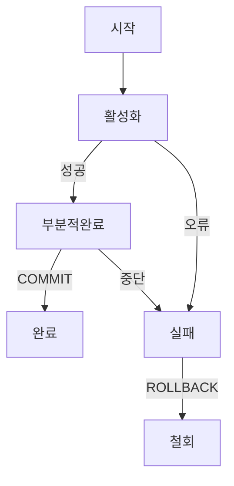

- 사용자나 프로그램에서 사용하기위해 저장/관리하는 데이터 집합
-  특징
	- 실시간 접근
	- 동시공유
	- 지속적 변화
	- 내용기반 참조: 데이터값을 이용해 데이터 접근
- 개념적 요소
	- 개체(entity)
	- 속성(attribute)
	- 관계(relationship)
- 스키마: 데이터베이스의 전체 구조와 제약조건을 명시하기위해 사용
	- 내부 스키마: 사용자 측면에서 데이터베이스의 전체 구조
	- 개념 스키마: 데이터베이스의 전체 구조
	- 외부 스키마: 물리적 저장장치 측면에서의 데이터베이스 구조

## 관계형 데이터베이스
- 데이터가 2차원 테이블에 저장됨.
- 데이터의 구조, 데이터간 종속성을 알 수 있음
- 테이블을 이용해 종속성과 관계를 나타냄
- 스키마를 ERD or 문자열로 표현가능
- 릴레이션: 관계형 데이터 베이스에서 데이터의 개념적 모델
- 테이블: 릴레이션을 실제로 구현한 개체
- 행(튜플, 레코드): 데이터 묶음
- 열(속성, 필드): 이름과 타입을 가짐

### 키
- 튜클을 구분하기 위한 속성/속성의 집함
- 특성
	- 유일성: 하나의 키값으로 튜플을 식별가능
	- 최소성: 튜플을 식별하는데 필요한 속성만으로 이루어짐
- DBMS 키 유형
	- 슈퍼키: 튜플을 식별할 수 있는 유일성O, 최소성X
	- 후보키: 유일성+최소성
	- 기본키: 후보키 중에서 메인이되는 키. NULL은 안됨
	- 대체키: 후보키 중 기본키를 제외한 키
	- 외래키: 다른테이블의 기본키 참조
	
	

### 무결성
- 데이터베이스에 저장된 데이터와 실제 데이터가 일치하는 정확성, 데이터가 일정하게 유지되는 일관성을 의미 
- 종류
	- 개체 무결성: 모든 테이블은 기본키를 가져야함. NULL이 될수없고 중복X
	- 도메인 무결성: 테이블의 속성 값은 도메인(속성이 가질 수 없는 값의 집합)에 속해야한다. 
	- 참조 무결성: 외래키의 값은 참조하는 테이블의 기본키 값과 동일하거나 NULL이어야함

### 인덱스
- <mark class="hltr-cyan">데이터베이스에 저장된 튜플의 검색기능을 높이기위해 속성값과 튜플이 저장된 주소를 저장</mark>
- 키-값 형태로 '속성 값-튜플주소' 를 인덱스 테이블에 저장 -> 속성값을 기준으로 정렬상태 유지
- 장점
	- 인덱스 테이블에 데이터가 정렬되어있어 검색속도 빠름
- 단점
	- 인덱스 테이블을 위한 추가공간 필요
	- 정렬상태 유지를 위해 데이터 추가, 수정, 삭제 속도가 느림.(재정렬해서)
	- 튜플의 삭제연산 시 인덱스 테이블에서는 '사용하지않음' 처리가 되지만, 실제로 삭제가되지않고 테이블에 남아있음.
	
		
	
		테이블에서 빼빼로를 삭제했지만 오른쪽 인덱스 테이블엔 빼빼로가 남아있암
		즉, 삭제연산이 빈번하게 일어나면 인덱스 테이블 크기가 줄지않아 성능저하가 발생할 수 있다
	=><mark class="hltr-cyan">데이터 양이 방대하며 데이터 변경보다는 검색을 자주하는 경우에 사용</mark>

#### 해시 테이블 인덱스
- <mark class="hltr-cyan">속성값으로 해시 값을 계산해 인덱싱</mark>.
- 해시함수 특성상 속성값을 그대로 검색해야해서 검색하려는 값을 온전히 입력할때만 사용 가능
	- 불가능: '빼로 시작하는 속성 값' 인덱스 검색
	- 가능: '빼빼로'의 인덱스 검색
- 빠르지만 자주 사용 X

#### B+- 트리 인덱스
- 트리구조의 B+ 트리 인덱스 or B- 트리 인덱스 방식을 많이 사용.
- B+ 트리는 단말노드에만 데이터를 저장. 단말 노드간에는 연결리스트로 연결됨.
- B- 트리는 모든 노드에 데이터가 저장되는 방식
- 데이터 삽입, 갱신, 삭제 비용 절감 가능.
- 속성범위 검색 가능

#### ORM
- 객체와 관계형 데이터베이스를 매핑하는 도구
- DB를 프로그래밍 언어의 객체 관점으로 바라볼 수 있어 객체지향 프로그래밍 언어를 사용해 개발할때 편리.
- SQL문 없이 객체지향 코드 작성 가능
- ORM만으로 서비스 구현은 어려움

## NoSQL DB
- <mark class="hltr-cyan">유연한 형태의 비관계형 데이터베이스</mark>
- 형태
	- 도큐먼트
	- 그래프
	- 키-값
	- 와이드 컬럼
- 대용량 데이터 조회 시 속도면에서 유리
- 수평적 확장성이 좋아 서버를 추가해 확장하기 쉬움
- 데이터 확장/대용량 데이터 조회가 빈번히 일어나는 경우 사용하기 좋음

>![info]
>- 계층형 데이터베이스: 데이터간 부모-자식관계를 갖는 트리형태의 데이터베이스. 개체간 1:N 관계를 가져 인대다 관계라고도 함
>- 네트워크형 데이터베이스: 트리형태의 데이터베이스이나 계층형 데이터베이스와 달리 개체간에 N:M관계를 갖는 그래프 구조를 가짐

## 트랜잭션
- <mark class="hltr-cyan">데이터베이스의 상태를 바꾸기 위해 수행하는 작업의 단위/일련의 연산</mark>
- ACID 특징
	- 원자성(Atomicity): <mark class="hltr-cyan">트랜젝션이 데이터베이스에 완전 반영 or 아예 실행X</mark>
	- 일관성(Consistency): 트랜잭션 수행 완료된 DB는 일관성이 있음
	- 독립성(Isolation): 수행중인 트랜잭션에 다른 트랜잭션이 끼어들 수 X
	- 영속성(Durability): 완료한 트랜잭션 결과는 영구 반영
- 트랜잭션 제어를 위한 TCL 명령어
	- COMMIT: 트랜잭션 정상 종료, 데이터베이스에 변경사항 반영
	- ROLLBACK: 비정상종료되어 트랜잭션이 변경한 사항 취소, DB를 이전으로 돌림
	- SAVEPOINT: 트랜잭션의 특정지점을 지정. ROLLBACK과 사용하면 해당 지점까지 되돌릴수있음
- 트랜택션 상태
	- 활성화: 트랜잭션이 시작, 처리중
	- 부분적 완료: 마지막 연산까지 완료되었지만 데이터베이스에 결과반영이안됨
	- 완료: 연산처리 완료, 데이터베이스 결과반영 완료
	- 실패: 처리중 오류 발생. 중단상태
	- 철회: 중단된 트랜잭션에 ROLLBACK을 수행. DB를 이전으로 돌림

- 트랜잭션 격리
	- 트랜잭션이 서로 영향을 미치지않고 실행할 수 있는 단계
	- 한 트랜잭션이 다른 트랜잭션 잡업의 조회가능 여부를 결정
	- 4단계로 나뉨
		- Read Uncommited: 트랜잭션의 COMMIT 여부와 상관없이 다른 트랜잭션이 데이터조회가능. 한번에 여러 트랜잭션을 처리가능해 동시성은 높으나 일관성유지가 어려움
		- Read Commited: 트랜잭션이 Commit된 데이터만 다른 트랜잭션이 조회 가능
		- Repeatable Read: 트랜잭션이 읽은 데이터를 다른 트랜잭션이 갱신, 삭제 불가
		- Serializable: 트랜잭션이 읽은 데이터를 다른 트랜잭션이 갱신, 삭제, 삽입 불가
		- 

### 락
- <mark class="hltr-cyan">트랜잭션이 처리되는 순서를 보장하기위한 방법</mark>
- 운영체제에서 데이터 동기화를 위해 임계영역 접근을 제한하는 상호배제 기법과 유사
- 종류
	- 공유 락(shared lock, 읽기 락): 데이터를 읽는 락. 데이터를 읽는 연산이라 일관성에 영향을 주지않아 여러 공유 락이 동시접근 가능
	- 베타 락(exclusive lock, 쓰기 락): 데이터 수정 락. 일관성 유지를 위해 데이터에 하나의 베타 락이 접근 중일때 다른 베타 락이 접근 불가
- 교착상태: 한 트랜잭션이 자신이 처리중인 데이터에대해 락을 가진 상태에서 다른 트랜젝션이 처리중인 데이터에 락을 요청해 <mark class="hltr-cyan">무한대기 상태</mark>에 빠짐
  = 특정 데이터의 락을 가진 트랜잭션이 다른 데이터의 락을 추가로 요청
	- 해결 방법
		- 예방 기법: 트랜잭션 처리 시작전에 데이터에 대해 미리 락을 얻음
		- 회피 기법: 트랜잭션이 들어온 순서에 따라 교착상태 회피
		- wait-die: 데이터의 락을 요청하려는 트랜잭션이 해당 데이터에 락을 가진 트랜잭션보다 오래되었다면 wait. 락을 가진 트랜잭션보다 최신이라면 die(포기)
		- wound-wait: 락을 요청하는 트랜잭션이 락을 가진 트랜잭션보다 오래되었다면 뺏고, 최신이라면 wait

### 이상
- 트랜잭션 처리 중 속성 간 종속이나 데이터 중복으로 발생하는 문제
- 종류
	- 삽입 이상: 삽입시 의도치않게 다른 데이터도 삽입됨
	- 갱신 이상: 데이터 갱신 시 일부 튜플만 갱신되어 데이터 모순 발생
	- 삭제 이상: 데이터 삭제 시 의도하지 않은 데이터도 삭제

### 정규화
- 테이터베이스의 이상현상을 해결하기 위해 테이블을 분해.
- 연산시간이 증가한다는 단점을 가짐. 상황에따라 적절하게 정규화를 해야함
- 정규형: 정확한 결과
- 분해도에따라 단계를 나눌수있음(데이터베이스 내 데이터 수정 고려X것을 전제로 설명)
	
	- 제1정규형
		- <mark class="hltr-cyan">테이블의 모든 속성값이 더이상 분해될 수 없는 원자값으로 구성</mark>
		  속성에 2가지 값이 들어가는 한 튜플을 2개의 튜플로 분리
	- 제2정규형
		- <mark class="hltr-cyan">부분적 함수 종속성 제거</mark>. 완전 함수 종속을 만족해야함
			- 함수 종속성: 테이블에서 속성간 종속관계를 의미. A속성이 B속성을 결정하면 A를 결정자. B를 종속자라고 함
			- 완전 함수 종속: A속성이 B속성을 결정, A속성의 진부분집합이 B속성을 결정하지않는 경우
			- 부분적 함수 종속성: 기본 키의 부분집합이 결정자가될 수 있음. 
		  => <mark class="hltr-cyan">기본키의 진부분집합이 결정자가 될수없도록 테이블을 분해</mark>
			
			
			
			판매처에대한 테이블을 분리해 완전함수종속 만족
	- 제3정규형
		- 제2정규형에 속하는 테이블에서 <mark class="hltr-cyan">이행적 종속이 없어야함</mark>
			- 이행적 종속: A속성이 B속성을 결정, B속성이 C속성을 결정할때, A속성이 C속성을 결정하는 것
			=> A->B, B->C 테이블로 분리
	- 보이스-코드 정규형(강한 제3정규형)
		- 제3정규형에 속하는 테이블의 모든 결정자가 후보키가되도록 테이블 분해   
	- 제4정규형
		- 제3정규형에속하면서 <mark class="hltr-cyan">다치종속 제거</mark>
			- 다치종속: 테이블에서 한 속성이 여러 속성의 값을 결정
	- 제5정규형
		- 제4정규형에 속하면서 <mark class="hltr-cyan">조인종속이 없어야함</mark>
			- 조인종속: 테이블을 분해했다가 조인할때 테이블이 복원됨
- 역정규화: 정규화된 테이블을 낮은 단계의 테이블로 되돌림. 읽기성능 향상을 위해 사용.(조인 방지 위해 중복허용)
