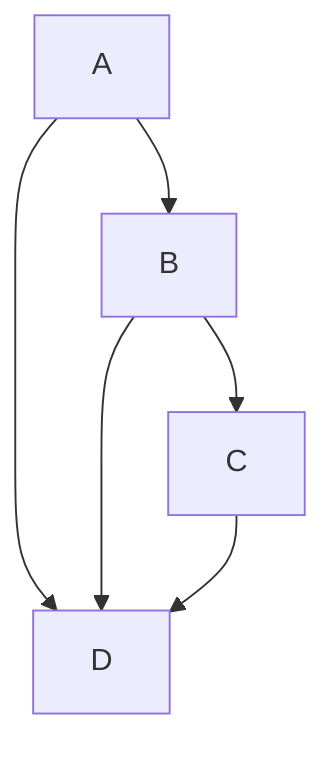

# 복잡도
- 시간복잡도: 알고리즘의 실행시간을 정량화
- 공간복잡도: 실행하는데 필요한 메모리 사용량을 정량화
- 빅오표기법: <mark class="hltr-cyan">입력값(n)에 대한 수식에서 최고차항을 기준으로 알고리즘이 수향되는 최악의 시간 복잡도</mark>. 점근적 표기법
- 점근적 표기법: 연산의 수가 극한에 수렴할때 최고차항을 제외한 나머지항이 복잡도에 미친는 영향이 미미해서 계수, 상수항 등을 무시
	- 최악의경우 - 빅오표기법
	- 평균의 경우 - 빅세타표기법
	- 최선의 경우 - 빅오메가 표기법

# 선형 자료구조
- 연속적으로 데이터가 나열되는 자료구조. 하나의 데이터 뒤에 다른 하나의 데이터가 연결됨
- 대표적 선형자료구조
	- 배열
		- 정해진 크기만큰 데이터가 일렬로 저장되는 정적 자료
		- 요소 - 각 데이터, 인덱스: 데이터를 가르키는 번호
		- 접근: O(1)
		- 검색: O(n)
			- 인덱스 0에서 타겟데이터까지 하나씩 탐색해야함
		- 삽입: O(n) or O(1)
			- 추가하려는 특정 위치에 있던 데이터를 뒤로 밀어야함(기존배열의 크기가 5였다면 6으로 늘리고 추가하려던 위치에있건 기존데이터를 한칸 뒤로) - O(n)
			- 배열의 가용공간보다 배열크기가 작은 경우, 해당데이터를 저장할 공간이 비어있어 바로 저장가능. - O(1)
		- 삭제: O(n) or O(1)
			- 해당 인덱스의 데이터를 삭제 후 뒤의 인덱스에 데이터를 한칸씩 당겨야함. - O(n)
			- 삭제하는 데이터가 마지막 데이터 - O(1)
	- 단순 연결 리스트
		- 크기가 정해져있지않은 여러개의 노드로 이루어진 동적 자료구조
		- 헤드 포인터와 테일 포인터로 시작/끝을 알수있음.
		- 마지막 노드는 가르키는 노드가없어서 다음 노드 주소값이 NULL임
		  
		
		
		- 메모리가 연속적으로 저장되지않아도 필요연산 수행가능.
		- 데이터 추가/삭제가 자유로움(노드가 추가되어도 기존 노드들의 위치를 바꾸지않아도됨)
		- 배열과 달리 인덱스가없어서 특정위치의 데이터에 접근하는 데 배열보다 오래걸림
		- 검색 O(n)
			- 첫번째 노드부터 하나씩값을 확인해야함
		- 추가
			- 추가연산 자체는 O(1)
			- 데이터를 추가하려는 위치까지 이동하기까지 O(n)
		- 삭제
			- 첫번째 데이터 삭제 - O(1)
			- 나머지 위치 데이터 삭제 O(1) + 데이터 삭제위치까지 이동 O(n)
	- 이중연결리스트
		- 노드가 앞노드 주소값, 뒷노드 주소값을 모두 저장.
		- 양방향 탐색 가능
		- 단순연결리스트보다 구현이 어렵고 한 노드당 값 2개를 저장해야해서 메모리를 많이 차지함
		- 노드의 연결순서와 무관하게 노드를 연속적으로 탐색해야하는 경우 단순연결리스트에비해 시간이 효율적
	- 원형연결리스트
		- 마지막 노드가 NULL이 아닌 첫번째노드값을 가르킴.
		- 헤드가 마지막 노드를 가지키면 삽입/연산을 효율적 수향
		- 새 노드를 맨앞/맨뒤에 삽입할때 상수시간이 소요됨
		- 순환구조라서 어떤 노드든 배열의 다른노드에 모두 접근 가능
	- 스택
		- 후입선출
		- 삽입 - push, 삭제 - pop
		- O(1)로 마지막 데이터 접근
		  
		
		
	- 큐
		- 선입선출
		- 맨앞을 front, 맨뒤를 rear라고함
		- 인큐: 맨뒤에 데이터 삽입
		- 디큐: 맨앞에서 삭제
		  
		
		
		- 프로세스가 CPU를 할당받기전 대기하는 준비 큐가 대표적
		- 인큐/디큐 수행시 front나 rear만 수정하면됨
		- 데이터 삽입 연산으로 큐를 꽉 채운후 1개만 남기고 삭제연산을 수행하면 rear의 인덱스만보고 꽉찼다고 오해가능
		- 순환 큐(원형 큐)
			- 배열의 앞부분부터 데이터를 삽입. 배열 시작/끝이 구분되지않아 삽입/삭제가 유연함
	- 덱
		- 양쪽 끝에서 데이터의 삽입/삭제가 가능한 구조
		- 큐+스택

## 비선형 자료구조
- 하나의 데이터 뒤에 N개의 데이터가 이어질 수 있음
- 계층적 구조를 나타내기 편함
### 그래프
- 데이터를 포함하는 정점(노드), 정점을 잇는 간선으로 구성
  

	
- 용어 정리
	- 인접: 두 정점이 간선으로 연결되어있으면 인접하다고함
	- 치수: 정점에 연결된 간선의 수(B-3개)
	- 집입 차수: 해당 정점으로 향하는 간선의수(B-1)
	- 진출 차수: 해당 정점에서 나가는 간선의 수(B-2)
	- 경로:한정점에서 다른정점으로 이어지는 정점들의 리스트
	- 경로길이: 경로를 구성하는 간선의 수
	- 단순경로: 모두 다른정점으로 구성된 정료
	- 사이클: 한 정점에서 시작해 같은 정점으로 돌아올수있음
- 종류
	- 무방향 그래프
		- 간선에 방향이없음.
		- 두 정점이연결되어있을뿐 순서는 없음 => A-B, B-A는 동일간선
		- 최대간선개수 = n * (n - 1) / 2
	- 방향 그래프
		- 간선에 방향있음.
		- 최대간선개수 = n * (n-1)
	- 부분 그래프
		- 기존 그래프에서 일부 정점/간선을 제외
	- 가중치 그래프
		- 간선에 비용이나 가중치가 할당됨
	- 완전 그래프(연결 그래프)
		- 간선을 최대로 가진 그래프
		- 정점 개수가 n개일때 무방향 그래프의 간선수가 n * (n-1)면 완전그래프
		- 방향 그래프에서 간선수가 n*(n-1)이면 완전그래프
	- 유향 비순환 그래프
		- 방향그래프면서 사이클이없음

#### 경로탐색
- 너비 우선 탐색(BFS)
	- 탐색을 시작하는 정점에서 가까운 정점을 먼저 탐색
	  
	
	

| 정점    | 최단거리 |
| ----- | ---- |
| A     | 0    |
| B,C   | 1    |
| D,E,F | 2    |

- 깊이 우선 탐색(DFS)
	- <mark class="hltr-cyan">시작 정점에서 탐색가능한 최대 깊이의 정점까지 탐색</mark>
	- 최대깊이 정접 도달시 방문정점을 역순으로 재방문해 탐색가능한 정점을 확인함
	- 재귀호출 혹은 스택으로 구현
	  
		

### 트리
- 그래프의 한 종류로 사이클이없어 계층적 관계 표현가능
- 용어
	- 루트노드: 부모노드 없는 노드. 트리에 단 한개
	- 부모로드: 루트노드 방향으로 연결된 노드
	- 자식노드: 루트노드 반대방향으로 연결된 노드
	- 단말노드: 자식노드없는 노드
	- 형제노드: 부모노드가 같은 노드
	- 레벨: 루트노드로부터 노드의 상대적 위치. 루드노드가 0임
	- 높이: 트리의 최대레벨 + 1
	- 차수: 자식노드 개수
	- 
- 이진트리
	- 자식노드가 최대 2개인 트리
	- 종류
		- 완전 이진트리: 트리의 마지막 레벨을 제외한 모든 레벨이 노드가 채워짐. 마지막 레벨은 왼쪽 -> 오른쪽으로 노드가 채워짐
		- 포화 이진 트리: 마지막레벨까지 모두 노드가 채워져있음. 완전이진트리이기도함
		- 이진탐색트리
			- 한 노드의 횐쪽 서브트리는 해당 노드의 값보다 작은 값을 가진 노드로 구성. 오른쪽 서브트리는 해당노드의 값보다 큰 값
			- 완전 이진트리로 이진탐색트리를 구성하려면 균형 이진 탐색 트리가 필요
			- 대표적인 예로 균형탐색트리(삽입/삭제해도 트리균형 유지)인 레드-블랙 트리, AVL 트리가있음
				- 레드블랙트리
					- 노드가 검은색 or 빨간색. 정해진규칙을 만족하며 균형 유지
					- 이진탐색트리면서 트리에 대한 연산 수행 시 조건을 만족못하면 회전/색변환으로 노드 재배치
						- 조건
							- 모든 노드는 검은색or빨간색
							- 루트노드는 검정색
							- 모든단말노드는 검정색. 단말노드는 트리의 끝을 나타내며 값을찾지않음
							- 빨간노드의 자식노드는 검은색. 빨간색 노드가 연속으로 못나옴
							- 루트노드에서 임의의 단말노드까지 경로에 검은색 노드의 개수는 모두같음
				- AVL 트리
					- 자가 균형 이진탐색 트리
					- 왼쪽서브트리와 오른족 서브트리의 높이를 뺀 값인 BF를 사용
						- 왼쪽서브트리와 오른쪽 서브트리의 높이차이는 최대 1
						- 왼쪽 서브트리와 오른쪽 서브트리의 높이차이가 1보다 거지면 균형을 잡아 높이차이를 줄일
					- 4가지 불균형상황(발생시 트리를 회전해 균형을 유지함)
						- LL: 왼쪽으로 불균형을 이룰 경우 가운데 노드를 중심으로 오른쪽회전
						- RR: 오른쪽으로 불균형을 이룰 경우 가운데 노드를 중심으로 왼쪽회전
						- LR: 왼, 오른쪽 불균형을 이룰 경우 마지막 레벨에 위치한 노드를 중심으로 왼쪽으로 회전 -> 다시 오른쪽 회전
						- RL: 오, 왼쪽으로 불균형을 이룰경우 마지막 레벨에 위치한 노드를 중심으로 오른쪽으로 회전 -> 왼쪽회전

### 우선순위 큐
- 우선순위가 높은 데이터가 먼저 나오는 자료구조

| 구현방법                        | 삽입       | 삭제       |
| --------------------------- | -------- | -------- |
| 배열(unsorted array)          | O(1)     | O(n)     |
| 연결리스트(unsorted linked list) | O(1)     | O(n)     |
| 배열(sorted array)            | O(n)     | O(1)     |
| 연결리스트(sorted linked list)   | O(n)     | O(1)     |
| 힙(heap)                     | o(log n) | o(log n) |

### 힙
- <mark class="hltr-cyan">완전 이진트리. 최댓값 또는 최솟값을 빠르게 찾을 수 있는 자료구조</mark>
	- 최대 힙: 부모 노드 값이 자식노드의 값보다 크거나 완전 같은 이진트리
	- 최소 힙: 부모 노드의 값이 자식노드의 값보다 작거나 같은 완전 이진트리
- 삽입연산: 힙의 맨끝에서 이루어짐. 부모노드와 우선순위를 비교해 부모노드보다 우선순위가 높으면 위치를 바꾸면서 루트노드까지 비교
- 삭제연산: 힙에서 데이터삭제는 우선순위가 가장 높은 데이터 노드를 삭제하는 연산임. 즉 루트노드를 삭제하게됨. 삭제 후 루트노드자리에 힙의 마지막 노드를 옮긴 후 힙을 재정렬

### 해시테이블
- <mark class="hltr-cyan">하나의 키에 하나의 값을 저장하는 자료구조</mark>
- 해시함수를 이용해 해시를 얻을 수 있음
- 해시: 값이 저장되어있는 해시 테이블의 인덱스를 찾을 수 있는 값
- 평균적으로 O(1)
- 해시 충돌: 서로 다른키에대해 같은 해시가 도출됨.
	- 체이닝: <mark class="hltr-cyan">같은 해시가 나오는 키의 값을 연결리스트에 저장</mark>. 저장공간에대한 제약이 적지만 하나의 해시에 인덱스가몰릴수도있음
	- 개방 주소법: 해당해시가 아닌 <mark class="hltr-cyan">비어있는 공간에 값을 저장</mark>.
		- 선형조사법: h[n]에서 충돌이 발생하면 h[n+1], h[n+2]와 같이 다음인덱스로 이동하며 빈 공간을 찾음. 충돌시 다음인덱스에 데이터를 저장해 특정 인덱스 범위에 데이터가 몰리는 군집화현상 위험
		- 이차조사법: h[n]에서 충돌이 발생하면 h[n+1 * 1], h[n+2 * 2]와 같이 거듭제곱한 인덱스만큼 이동, 빈공간을 찾으면 데이터 저장. 군집화현상이 적지만 완전해결X
		- 이중해싱: 해시충돌 발생시 다른해시함수를 한번 더 적용