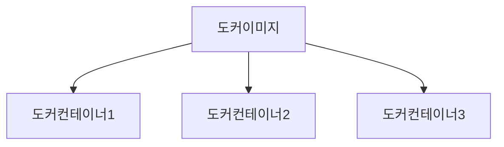

hello-world라는 프로그램을 도커환경에서 실행할때 흐름 정리

1. 도커 클라이언트에 명령을 위한 명령어 입력(터미널 실행 . `docker run hello-world` 입력), 클라이언트에서 도커 서버로 요청을 보냄
2. 서버에 hello world 라는 이미지가 로컬에 다운 돼있는지 확인
3. 기존에 내려받은 hello-world이미지가 없기때문에 Unable to find image 'hello-world:lastest locally'라는 문구가 출력됨(이미 이미지가 로컬에 있으면 . 이문장없이 바로 실행됨. 바로 6번으로)
4. 도커 이미지가 저장된 도커허브에서 hello-world 이미지를 가져오고 로컬에 보관
5. 이제 hello-world 이미지가 있으니 그 이미지를 이용해서 컨테이너 생성
6. 생성된 컨테이너는 이미지에서 받은 설정이나 조건에 따라 프로그램을 실행

- 가상화 기술과 도커의 차이점
	- 가상화 기술이 나오기 전 서버를 사용하던 방식: 한대의 서버를 하나의 용도로만 사용 -> 남는 서버공간은 방치. 
	- 하이퍼바이저 기반의 가상화 기술: 논리적으로 공간을 분할하여 가상머신(VM)이라는 독립적인 가상환경에서 서버를 이용. 호스트 시스템에서 다수의 게스트 운영체제를 구동 가능, 하드웨어를 가상화하며 하드웨어와 각각 가상 머신을 모니터링하는 중간관리자 역할
	  
		
		
		- 네이티브 하이퍼바이저: 하이퍼바이저가 직접 하드웨어를 제어하기 때문에 자원을 효율적으로 사용 가능. 별도의 호스트 OS가 필요없어 오버헤드가 적음. 그러나 여러 하드웨어 드라이버를 세팅해야해서 설치가 어려움
		- 호스트형 하이퍼바이저(많이 사용): 일반적인 소프트웨어처럼 호스트 OS위에 실행. 하드웨어 자원을 VM 내부의 게스트 OS에 에뮬레이트 하는 방식. 오버헤드는 크지만 게스트OS 종류에 제약이없고 구현이 다소 쉬움
		  
			
			
			하이퍼바이저에 의해 두공되는 가상머신은 각 가상머신마다 독립된 가상 하드웨어 자원을 할당받음.(다른 가상머신에 오류가 나도 퍼지지않음)
			
			위 그림과같이 논리적으로 분리되어있어 Core1은 Core1쪽에 있는 가상머신에만 이용되기때문에 Core1에 에러가 나도 Core2에 번지지않음
	- 도커
		
	- 공통점: 기본 하드웨어에서 격리된 환경 내에 애플리케이션을 배치하는 점이 같음
	- 차이점
		- 컨테이너가 제공하는 격리 기능 내부에 샌드박스가 있지만 같은 호스트의 다른컨테이너와 동일한 커널을 공유 -> 컨테이너 내부에서 실행되는 프로세스는 호스트 시스템에서 볼 수 있음(도커와 함께 MySQL DB컨테이너를 시작하면 도커가 아닌 호스트의 일반 셸에서 ps -e grep MySQL 명령어를 실행했을때 프로세스가 표시됨), 컨테이너가 전체 OS를 내장할 필요가 없어 가볍고 용량이 작음
		- 가상머신과 비교했을때 하이퍼바이저와 게스트OS가 필요없기때문에 가벼움
		- 애플리케이션을 실행할때 호스트 OS 위에 애플리케이션의 실행 패키지인 이미지만 배포하면 됨

- 도커 컨테이너의 구조

- Cgroup과 네임 스페이스: 다른 프로세스 사이에 벽을 만드는 리눅스 커널의 기능. 도커도 리눅스의 커널 기능을 이용하여 컨테이너와 CPU 등을 격리함
	-  Cgroup: CPU, 메모리, 네트워크 대역폭, HD I/O 등 프로세스 그룹의 시스템 리소스 사용량을 관리함(어떤 애플리케이션의 사용량이 너무 많으면 그 애플리케이션을 Cgroup에 배치해 CPU와 메모리 사용을 제한하는 식)
	- 네임 스페이스: 하나의 시스템에서 프로세스를 격리 하는 가상화기술. 별개의 독립된 공간을 사용하는 것처럼 격리된 환경을 제공하는 경량 프로세스 가상화 기술

하나의 컨테이너는 다른 컨테이너와 격리되며 그 안에 실행되는 프로세스를 작동시키기 위해 필요한 양에 맞는 하드디스크, 네트워크, RAM 등이 할당되어 있음

이렇게 격리된 컨테이너에서 프로세스를 작동시키는데 필요한 양만큼 하드웨어를 할당할 수 있는 것은 리눅스 커널에 있는 Cgroup과 네임 스페이스 기능을 이용하기 때문임

도커 컨테이너를 설치하는 환경과 별도로 도커 서버는 리눅스 VM환경에서 실행되기때문에 모든 컨테이너가 리눅스 가상머신에서 생성되며 리눅스 커널이 컨테이너를 격리시키고 리소스를 나누어줌

때문에 현재 환경과 별개로 도커컨테이너를 격리할 수 있는 Cgroup과 네임스페이스를 사용 가능

- 도커 이미지로 컨테이너 만들기

- 도커이미지: **프로그램을 실행하는데 필요한 모든것**을 가지고있음
	- 시작시 실행할 명령어: `run kakaotalk`
	- 파일 스냅숏: 카카오톡 파일
- 도커 컨테이너: 이미지의 인스턴스이며, 프로그램을 실행
	- 실행 순서 
		1. `도커 클라이언트에 docker run <이미지>` 
		2. 도커 이미지에 있는 파일 스냅숏을 컨테이너에 있는 하드디스크로 옮겨줌(컨테이너 안에서 애플리케이션을 설치하고 실행해야함으로 컨테이너로 이동시킴)
		3. 도커 이미지에서 가지고있는 명령어(컨테이너가 실행될 때 사용할 명령어)를 컨테이너에 전달
		4. 컨테이너가 실행될 때 명령어를 이용해 hello-world 애플리케이션을 실행
		

