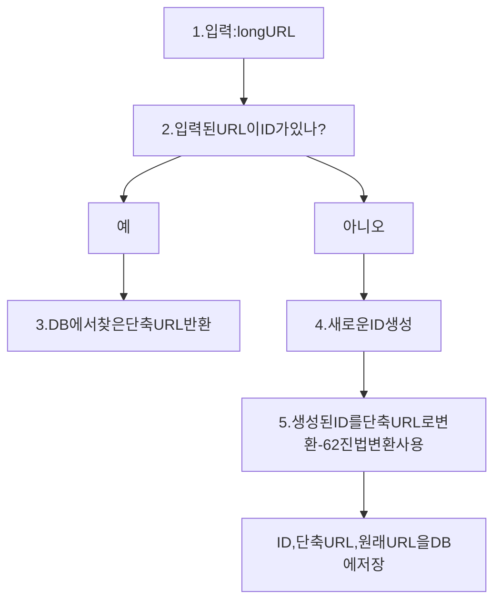

https://www.webservice.com/q-chatsystem&c-loggedin&v=v3&l=long 
같은 URL을 https://tinyurl.com/y7kes-eos
이런식으로 단축하는 것을 뜻함
- 조건 + 추정
	- 매일 1억개의 단축 url생성가능
	- 초당 쓰기연산 : 1억/24/3,600 = 1,160
	- 읽기연산 : 읽기, 쓰기연산 비율은 10:1이라 가정. -> 11,600
	- url단축 서비스를 10년간 운영한다 가정. 1억 * 365 * 10 = 365,000,000,000
	- 축약 전 url의 평균 길이는 100
	- 10년동안 필요한 저장 용량은 365,000,000,000 * 100바이트 = 36.5TB
#### API 엔드포인트
URL단축키는 기본적으로 두개의 엔드포인트를 필요로함
1. URL 단축용 엔드포인트 : 새 단축 URL을 생성하고자 하는 클라이언트는 엔드포인트에 단축할 URL을 인자로 실어서 POST요청
	- 인자 : {longUrl: longUrlString}
	- 반환 : 단축된 URL
1. URL 리디렉션용 엔드포인트 : 단축 URL에 대해 HTTP요청이 오면 원래 URL로 보내주기위한 용도의 GetMapping 엔드포인트
	- 반환 : HTTP리디렉션 목적지가 될 원래 URL
단축 URL을 받은 서버는 그 URL을 원래 URL로 바꾸어 301 응답의 Location 헤더에 넣어 반환.

> 301응답과 302응답의 차이
> - 301 Permanently Moved : 이 응답은 해당 URL에 대한 HTTP요청의 처리 책임이 영구적으로 Location헤더에 반환된 URL로 이전되었다는 응답. **브라우저는 이 응답을 캐시함.** -> 추후 단축 URL에 요청을 보낼 필요가있으면 캐시된 원래 URL로 요청을 보냄
> - 302 Found : 주어진 URL로의 요청이 일시적으로 Location헤더가 지정하는 URL에 의해 처리되어야한다는 응답. 요청은 언제나 단축 URL서버에 먼저 보내진 후 원래 URL로 리디렉션되어야함 
>   
>   서버 부하를 줄여야한다면 301을, 트래픽 분석이 중요하다면 302를 사용하는것이 유리. 301은 첫번째요청만 서버를 거치기때문임

단축 URL이 www.tinyurl.com/{hashValue} 의 형태라고 가정. 중요한것은 hashValue를 어떻게 찾을 것이냐가 될것임. 입력으로 주어지는 긴 URL이 다른값이면 해시도 다른값이 나와야하며 계산된 해시값은 원래 입력으로 주어진 긴 URL로 복원가능해야함
- 데이터 모델 : <단축URL, 원래 URL>의 순서쌍을 관계형 데이터베이스에 저장하는것이 좋음
##### 해시함수
- 해시 값 길이 : 0-9, A-Z, a-z로 이루어짐 -> 총 사용가능한 문자는 62개
- 해당 시스템은 3,650억개의 url을 만들어야하니 7자리(62^7은 총 3.5조개 생성가능)로 hash Value지정
###### 해시충돌 해소 방법
- 유명한 해시 함수인 CRC32, MD5, SHA-1을 사용가능하나 모두 7자리보다 긴 결과가 나옴
  -> 앞의 7자리만 잘라서 사용. 그러나 충돌 가능성 증가
  
~~~mermaid   
  
flowchart TD     

시작-->입력:longURL-->해시함수;    
  
해시함수-->shortURL;       
  
shortURL-->DB유무확인;   

DB유무확인-->없음;
DB유무확인-->있음;

없음-->DB에저장;
있음-->longURL뒤에사전에정한문자열추가;

longURL뒤에사전에정한문자열추가-->입력:longURL;
DB에저장--> 종료
  
~~~

충돌이 해소될때까지 위의 로직을 반복함.
생성할때마다 한번 이상의 쿼리를 날려야함. 오버헤드가 큼
대신 블룸필터를 사용하면 성능을 높일 수 있음
###### base-62변환
진법 변환은 URL단축기를 구현할때 흔히사용하는 방법임
해시키에서 사용할 수 있는 문자 개수가 62개라서 62진법을 사용
10진수의 ID를 62진수로 변환하는방법

| 해시 후 충돌 해소 전략                                       | base-62 변환                                                  |
| --------------------------------------------------- | ----------------------------------------------------------- |
| 단축 후 URL길이가 고정됨                                     | 단축 후 URL 길이가 가변적. ID값이 커지면 같이 길어짐                           |
| 유일성이 보장되는 ID생성기가 필요치 않음                             | 유일성 보장 ID생성기가 필요                                            |
| 충돌이 가능해서 해소 전략이 필요                                  | ID유일성이 보장된 후에 적용하기 때문에 충돌은 아예 불가능                           |
| ID로부터 단축 URL을 계산하는 방식이 아니라 다음에 쓸수있는 URL을 알아내는기는 불가능 | ID가 1씩 증가하는 값이라고 가정하면 다음에 쓸수있는 단축 URL이 뭔지 알아낼수있어 보안상 문제가 있음 |

