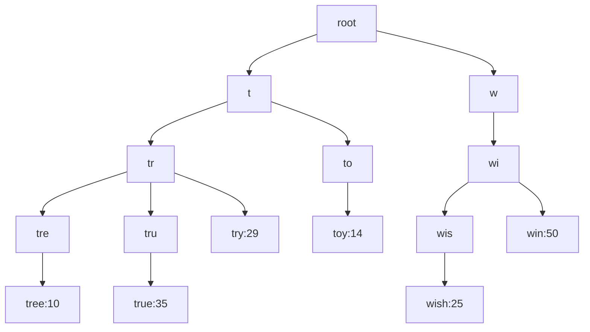
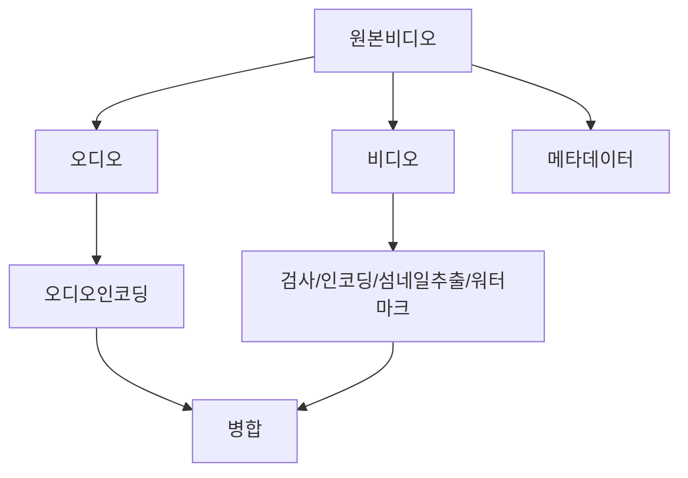
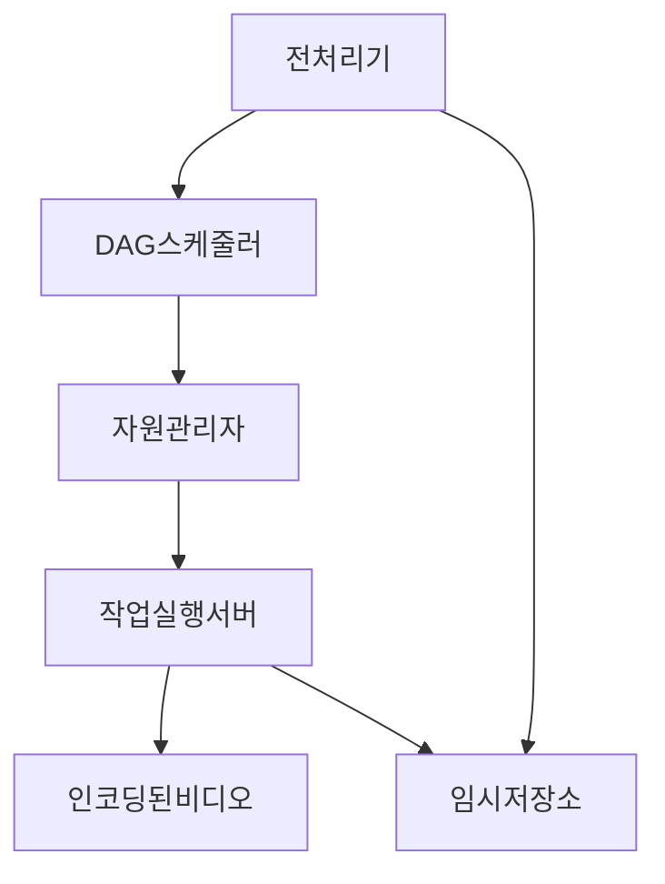
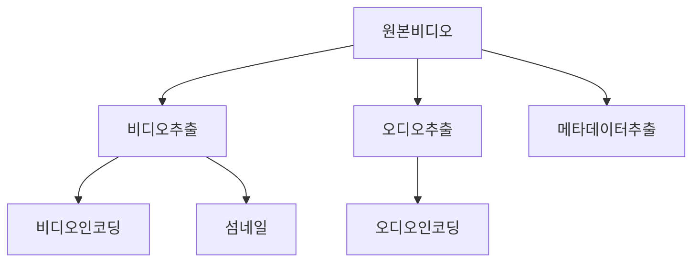

# 검색어 자동완성
- 기능
	- 속도
	- 연관성
	- 정렬(인기순)
	- 규모확장성
	- 고가용성
쿼리와 사용빈도를 저장하는 빈도테이블 생성하여 사용자가 입력한 검색어에 like문을 사용하여 빈도순으로 리턴하면되나 데이터가많아지면 병목가능성이있음
### 트라이 자료 구조
문자열을 간략하게 저장가능한 트리형태의 구조
 - 빈 문자열 - 빈노드로 표현
 - 각 노드는 글자를 하나 저장. 26개의 자식노드를 가질 수 있음
 - 노드는 하나의 단어or접두어 문자열을 나타냄
 

사용자가 tr을 검색했을때 먼저 tr노드를 먼저 찾고 자식노드 중 유효 노드인 tree:10, true:35, try:29를 찾음.
여기서 빈도로 정렬해여
true, try, tree 순으로 검색어가 조회될것임
성능 저하를 피하기 위해서는 접두어의 길이를 제한(검색기능 특성상 짧아도괜찮음)하거나 각 노드에 인기검색어를 캐시하는 것이 좋음. 캐시는 검색어별로 캐시를 하는것인데 저장공간이 많이소요됨. 그러나 속도가중요하다면 필수임

검색 빈도수 업데이트는 로그를 활용하면 좋음
<mark style="background: #ABF7F7A6;">데이터분석서비스 로그 -> 로그취합서버 -> 취합데이터 -> 작업서버 -> 트라이 데이터베이스(매주갱신) -> 트라이캐시(매주 데이터베이스의 상태를 스냅샷)</mark>
- 갱신 주기: 해당 서비스의 성격에맞게 조절이필요하나 일반적으로 일주일이면 충분(실시간 서비스는 더 짧게)
- 작업 서버: 비동기적 작업(job)을 실행하는 서버집합.
- 트라이 데이터베이스 : 문서저장소(몽고DB), 키-값 저장소를 활용하면 좋음 

### 추가 성능 개선(최적화)

- AJAX요청 : 페이지 새로고침x
- 브라우저캐싱 : 자동완성은 보통 짧은시간내에 자주바뀌지않음. -> 브아루저 캐시에 넣어두고 해당 캐시에서 바로 사용(구글검색엔진 사용방법)
- 데이터 샘플링 : N개 요청 중 1개만 로깅

### 트라이연산

트라이 갱신에는 매주한번씩, 트라이의 각 노드별로 개별갱신(성능이안좋음) 2가지방법이있음
- 검색어 삭제 : 트라이캐시앞에 필터계층을 추가해 부적절한 데이터는 반환되지않도록 제거. 필터계층이있으면 검색결과를 필터규칙에따라 자유롭게 변경가능하다는 장점이있음

### 저장소 규모 확장

- 데이터 샤딩 : 첫글자별로 샤딩. 최대 26개로 제한되는데 이 이상으로 서버를 늘리려면 샤딩을 계층적으로 해야함 -> 샤딩한 서버별로 균등하게 데이터저장하는것이 불가능 -> 샤딩 기준을 잘 잡아야함(1번서버는 A로 샤딩, 2번서버는 x~z로 샤딩 등)

- 추가 논의사항
	- 샤딩을 통해 작업대상 데이터 양 줄이기
	- 순위모델을 바꾸어 최근검색어에 가중치
	- 데이터가 스트림형태로 올수도있음

# 유투브

클라우드 CDN을 이용하여 비디오를 서비스할경우 CDN에서 나가는 데이터양에따라 과금이되는데 비용이 엄청날것으로 예상됨. 

- 트랜스코딩(인코딩) 서버 : 비디오 포맷 변환 절차. 단말이나 대역폭 요구사항에 맞는 최적의 비디오 스트림을 제공
- 트랜트코딩비디오 저장소 : BLOB저장소
- CDN: 비디오스트리밍은 CDN을통해 이루어짐
위 과정이 이루어지면서 병렬적으로 단말이 메타데이터 갱신요청을 api서버에 보냄. 요청에 포함된 파일이름/크기/포맷등의 정보로 캐시와 데이터베이스를 업데이트함
- 비디오 트랜스코딩(인코딩)
	- 저장공간을 줄이기위한작업
	- 하나의 비디오를 여러 포맷으로 인코딩해 호환성문제 해결
		- 컨테이너 : avi, mov, mp4
		- 코덱 : H.264, VP9, HEVC
	- 사용자에게 끊김없는 비디오 호출을 위해 화질별 인코딩
	- 네트워크상황에따라 화질자동변경/수동변경할수있도록 함
- 유향 비순한 그래프(DAG) 모델 

- 검사 : 좋은품질의 비디오인지/손상여부 확인
- 인코딩 : 360p, 480p, 720p, 1080p, 4K 등
- 섬네일
- 워터마크 : 식별정보를 오버레이형태로 띄움
##### 비디오 트랜스코딩 아키텍쳐

- 전처리기
	- 비디오 분할 : 비디오 스트림 GOP로불리는 단위로 쪼갬. 하나의 GOP는 독립적으로 재생가능하며 보통 몇초정도의 길이를 가짐(오래된단말은 지원안해서 전처리기가 대신함)
	- DAG생성
	- 데이터 캐시 : GOP와 메타데이터를 임시보관소에 보관함. 만약 인코딩실해파면 임시보관소에서 꺼내서 재시도함
- DAG스케쥴러 : DAG그래프를 몇단계로 분할해 그 각각을 자원관리자의 작업 큐에 집어넣음

- 자원관리자
	- 작업 큐 : 실행할 작업이 보관된 우선순위 큐.
	- 작업서버큐 : 작업서버의 가용상태정보가 보관된 우선순위 큐
	- 실행 큐: 현재실행중인 작업이 보관된 큐
	- 작업 스케쥴러 : 최적의 작업/서버를 선택해 작업수행지시. 선택한 후 실행큐에 넣어서 실행을 지시함. 완료되면 실행큐에서 제거
- 작업서버 : DAG에 정의된 작업 수행
### 시스템 최적화

- 속도 최적화
	- 비디오 병렬 업로드 : GOP를 분할해 병렬적으로 업로드하면 실패해도 빠르게 재시도가능
	- 업로드센터를 사용자 근거리에 지정
	- 모든 절차를 병렬화

- 안전성 최적화
	- 미리 사인된 업로드 URL(아마존 S3에서 쓰이는 용어)
		1. 클라이언트는 HTTP 서버에 POST요청을 하여 미리 사인된 URL을 받음. 해당 URL이 가르키는 객체에대한 접근권한은 이미 주어져있음
		2. api서버는 미리사인된 URL을 돌려줌
		3. 클라이언트가 해당 위치에 비디오를 업로드
	- 비디오 보호
		- DRM
		- AES암호화
		- 워터마크
- 비용최적화
	- 인기있는 비디오는 CDN을 통해 재생, 다른 비디오는 디비오서버를 이용
	- 인기없는 비디오는 인코딩이 필요없을수도있으며 짧은 비디오는 필요시 인코딩해도된다
	- 특정비디오는 특정지역에서만 인기있음. 다른지역에 옮길필요x
	- CDN직접구축/인터넷서비스제공자와 제휴 
### 오류 최적화

- 회복가능오류
- 회복불가능오류