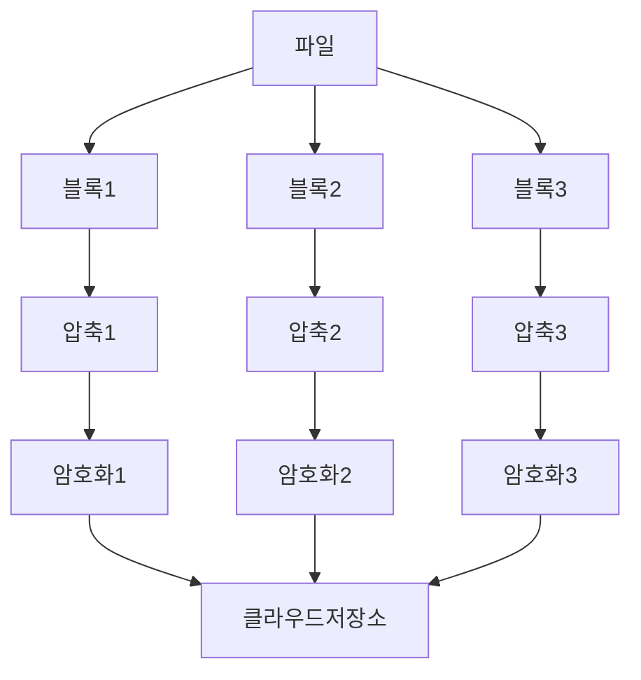

필요한 api는 단순업로드/이어올리기(네트워크중단가능성높음)/다운로드/갱신 임
![[Drawing 2024-03-31 14.25.43.excalidraw]]
- 블록저장소 서버 : 파일블록을 클라우드 저장소에 저장하는 서버. 파일을 여러 블록으로 나누고 각 블록에 고유 해시값이 할당됨.
	- 최적화 방법
		- 델타 동기화 : 파일 수정시 전체파일이아닌 수정된 블록만 동기화
		- 압축 : 블룩단위로 압축해두면 데이터크기를 줄일 수 있음

- 아카이빙 저장소 : 오랫동안 사용되지않은 비활성 데이터 저장
- 메타데이터 데이터베이스 : 사용자, 파일, 블록, 비전 등의 정보 관리. 실제파일은 저장소에있음
- 알림서비스 : 파일 추가/삭제 등 최신상태 확인용
- 오프라인 사용자 백업 큐 : 접속중이아니라 최신상태를 알수없을때 이 큐에 젛어 나중에 클라이언트가 접속했을때 동기화함
##### 높은 일관성
RDBMS는 ACID를 보장해서 일관성보장이 쉬우나 NoSql은 프로그램안에 동기화로직을 넣어야함
	- RDBMS 테이블
	- 유저
	- 디바이스 : 단말정보 보관, 모바일 푸시알람여부도 여기에
	- 루트디렉터리 정보
	- 파일 : 최신정보가 보관됨
	- 파일버전 : 파일 갱신이력이 보관됨
	- 블록 : 특정버전의 파일은 블록은 올바른순서로 조립하면 복원가능함
- 업로드
	- 메타데이터
		1. 파일 메타데이터 업로드 요청
		2. 새파일의 메타데이터를 DB에저장, 업로드 상태를 대기중으로 변경
		3. 새파일 추가를 알림서비스에 통지
		4. 알림을 클라이언트에게 전송
	- 클라우드 저장소
		1. 파일 업로드 요청
		2. 블록저장소 서버가 파일을 블록단위로 쪼갬->압축->암호화->클라우드저장소에 전송
		3. 업로드 완료시 클라우드스토리지가 완료 콜백 호출 -> 콜백 호출이 api서버에 전송
		4. 메타데이터에 기록된 해당파일의 상태를 완료로 변경
		5. 알림서비스에 파일업로드 완료 통지
		6. 알림을 클라이언트에게 전송
- 다운로드
	1. 알림서비스가 클라2에게 다른사용자의 파일변경알림
	2. 알림을 확인한 클라2가 새로운 메타데이터 요청
	3. api서버가 db에 새메타데이터 요청, 클라2에게 반환
	4. 클라2가 즉시 블록 다운로드 요청 전송
	5. 블록저장소 서버가 클라우드저장소에서 블록 다운요청 -> 클라2에게 반환
	6. 클라2는 반환된 블록으로 파일 재구성

> [!NOTE]
> 해당 서비스는 알람 서비스와 양방향 통신이 필요하지않기때문에 [[알림 시스템&뉴스 피드 시스템&채팅 시스템#^9c87fd||롱폴딩]]기법을 사용하는 것이 더 효율적임

- 저장소 절약 
	- 중복제거
	- 지능적 백업 전략 도입
		- 한도설정(상한도달시 오래된버전 버림)
		- 중요버전만 저장
		- 자주쓰이지않는 데이터는 아카이빙저장소로 이동(ex. s3->s3글래시어)
- 장애처리
	- 로드밸런서 장애 : 부 로드밸런서가 트래픽을 이어받아야함. 로드밸런서끼리는 박동신호로 서로의 상태를 모니터링함
	- 블록저장소 장애 : 다른서버가 미완료상태 작업을 이어받아야함
	- 클라우드저장소 장애 : s3버킷은 여러지역에 다중화가 가능하니 다른지역에서 가져옴
	- api장애 : 로드밸런서가 해당 트래픽을 장애서버로 보내지않음
	- 메타데이터 캐시 장애 : 캐시서버도 다중화
	- 메타데이터 데이터베이스 장애 : 부or주데이터베이스로 교체
	- 알림서비스 장애 : 모든 사용자와 하나씩 연결을 가지고있기때문에 하나의 서버에 장애발생시 모든 그 서버의 모든 사용자의 연결을 다시만들어야해서 복구가 느림
	- 오프라인 사용자 백업 큐 장애 : 다중화해두어야함, 