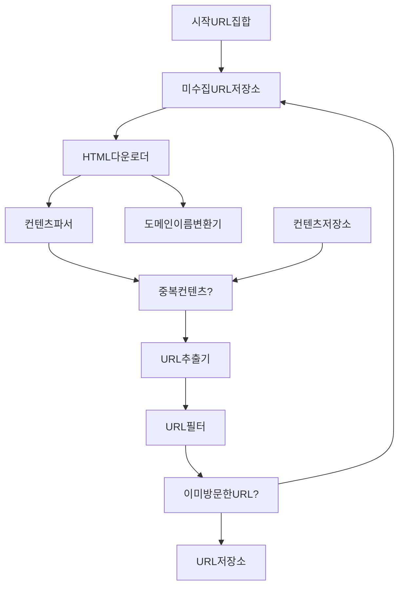
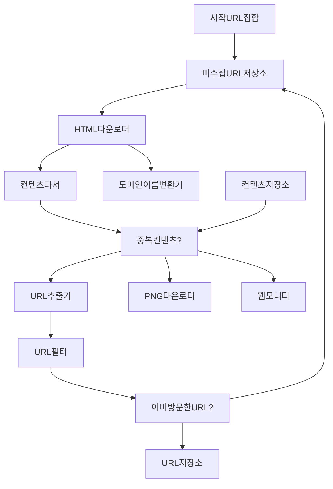

- 웹크롤러(로봇, 스파이더라고도 불림) 이용 방법
	- 검색 엔진 인덱싱(search engine indexing) : 크롤러의 가장 보편적인 용례로 웹 페이지를 모아 검색 엔진을 위한 로컬 인덱스를 만든다. googlebot은 구글검색엔진이 사용하는 웹 크롤러임
	- 웹 아카이빙(web archiving) : 나중에 사용할 목적으로 장기보관하기 위해 웹 정보를 모으는 절차. 대표적으로 미국 국회 도서관, EU웹아카이브가 있음
	- 웹 마이닝(web mining) : 인터넷의 유용한 지식을 도출해낼수있음. 유명 금융기업에서는 크롤러를 사용해 주주총회 자료나 연차보고서를 다운받아 기업의 핵심사업방향을 알아내기도함 
	- 웹 모니터링(web monitoring) : 인터넷의 저작권/상표권 침해 사례를 모니터링 가능. 디지마크사는 웹크롤러를 사용해 해적판 저작물을 찾아 보고함
- 기본 알고리즘
	1. URL이 집합으로 주어지면 해당 URL이 가르키는 모든 웹 페이지를 다운
	2. 다운받은 웹페이지에서 URL 추출
	3. 추출된 URL들을 다운할 목록에 추가, 위의 과정을 처음부터 반복
- 웹 크롤러 만족 속성
	- 규모확장성 : 뱡행성을 활용하면 더 효과적으로 크롤링 가능
	- 안정성 : 잘못작성된 HTML, 반응이없는 서버, 장애, 악성코드 등 비정상적 입력/환경에 대응가능해야함
	- 예절 : 수집대상이되는 웹 사이트에 짧은 시간동안 너무 많은 요청을 날리면 안됨
	- 확장성 : 새로운 형태의 콘텐츠를 지원하기 쉬워야함. (이미지를 추가 크롤링해야할때 전체시스템을 새로설계하는 일이 없도록 구현)
- 작업 흐름

1. 시작 URL 집합(정답은 없음)
	수집대상이되는 도메인이이름이 붙은 URL을 전부 시작URL집합으로 사용. 전체 웹이 대상인경우에는 전체 URL공간을 작은 부분집합으로 나누는 전략을 사용함
		-> 쇼핑, 스포츠 등 주제별로 세분화해 다른 시작 url을 사용하는 것
2. 미수집 URL 저장소
	크롤링 상태는 2가지로 나뉜다
	1. 크롤링상태를 다운할 URL -> 저장 관리하는 컴포넌트를 미수집 URL저장소(URL frontier)라고 부름. FIFO 큐라고 생각하면 편함
	2. 다운로드된 URL
3. HTML다운로더 : 미수집URL저장소가 다운로드할 페이지의 URL제공
4. 도메인 이름 변환기 : URL을 IP주소로 변환
5. 콘턴츠 파서 : 다운한 웹페이지는 파싱, 검증 절차를 거쳐야함. 크롤링 서버안에 구현하면 크롤링 과정이 느려질수있어 책에서는 독립 컴포넌트로 분리
6. 중복컨텐츠 : 가장간단한건 두 페이지의 문자열 비교지만 비교대상 모수가 많으면 비효율적이라 해시로 비교하는것이 좋음. 해시나 체크섬을 사용하면 쉽게 탐지 가능
7. 콘텐츠 저장소 : HTML문서 보관 시스템. 저장데이터 유형, 크기, 저장소접근 빈도, 데이터 유효기간 등으로 종합적으로 고려 후 선택해야함
8. URL추출기 : HTML페이지를 파싱하여 링크를 골라내는 역할. 
9. URL필터 : 특정 콘텐츠나 파일 확장자를 갖는 URL, 오류발생URL, 접근 제외목록에 포함된 URL을 크롤링대상에서 제외
10. 이미 방문한 URL : 같은 URL을 여러번 처리하는일 방지. 블룸필터나 해시테이블이 널리쓰임.
11. URL저장소 : 이미 방문한 URL을 저장
	
- 구현기술 : 웹 페이지는 노드, 하이퍼링크는 에지라고 보면됨. DFS, BFS중에선 BFS(넓이우선방식)이 적합함, 큐를 사용하는 알고리즘인데 웹페이지의 깊이가 얼마나 깊은지 파악하기 힘들기때문임.
	- 한 페이지에서 나온 링크는 대부분 내부링크임 -> 병렬로 처리하면 해당 서버에 너무 많은 요청을 날림
		=> 미수집 URL 저장소로 해결 가능. 동일한 웹사이트에서는 한번에 한 페이지만 요청할수있도록 구현해야함.(예의바른 크롤러)
		웹사이트의 호스트명과 작업스레드 사이의 관계를 유지하여 스레드를 별도 큐에 저장하는것.
	- URL에 우선순위를 두지않음. 하지만 순위, 트래픽양, 업데이트 빈도에 따라 우선순위를 구분하는것이 효율적임
	  => 순위결정장치 사용. URL의 우선순위별로 큐가 하나씩 할당. 큐 선택기가 우선순위가 높은 큐에서 더 자주꺼내도록 구현함.
		![[Drawing 2024-03-24 13.51.36.excalidraw]]
		- 전면 큐 : 우선순위 결정과정 처리
		- 후면 큐 : 크롤러가 예의바르게 동작하도록 보증
	- 신선도 : 웹페이지가 업데이트될수도있어 이미 저장한 페이지라도 갱신해주어야함. 그러나 모든 페이지를 갱신하면 많은 시간과 자원이 소모됨
	  -> 변경이력 + 우선순위 사용으로 해결
  - HTML다운로더
	  - 로봇제외 프로토콜(Robots.txt) : 웹사이트가 크롤러와 소통. 이 파일에 수집해도되는 페이지의 목록이있음. 거푸다운로드를 피하기위해 주기적으로 다운받아 캐시에 보관함. 
	  - 성능 최적화
		  - 분산크롤링 : 여러 서버에 분산. URL공간은 작은 단위로 분할해 각 서버는 그 중 일부의 다운로드를 담당
		  - 도메인이름 변환 결과 캐시 : 도메인변환기가 크롤러의 병목중 하나인데 DNS요청 전송/수신작업의 동기적 특성때문임.(수신전까지 다음작업 못함) 따라서 DNS조회 결과로 얻어진 도메인 이름과 IP 사이의 관계를 캐시에 보관해  크론잡을 통해 주기적으로 갱신하여 성능향상가능
		  - 지역성 : 크롤링 서버를 지역별로 분산
		  - 짧은 타임아웃 : 웹 서버가 응답이없을때를 대비해 일정기간동안 응답이없으면 다음페이지로 넘어감
	  - 안정성 
		  - 안정해시 : 서버 쉽게 추가/삭제 가능
		  - 크롤링 상태 및 수집 데이터 저장 : 장애에도 쉽게 복구가능하도록 크롤링 상태, 수집데이터를 지속적 저장장치에 기록
	  - 예외처리
	  - 데이터검증
	  - 확장성
		  PNG다운로더(PNG 다운로드 플러그인), 웹모니터(웹을 모니터링해서 저작권/상표권 침해를 막음), URL추출기는 확장모듈임

- 거미 덫 : 크롤러를 무한 루프에 빠뜨리도록 설계한 웹 페이지(무한히 깊은 디렉터리구조를 포함). URL의 최대 길이를 제한하면 회피할수있지만 만능 해결책은 아님. 사람이 수작업으로 덫을 확인하고 찾아낸 후 탐색대상에서 제외하는것도 방법임
- 데이터 노이즈 : 광고, 스크립트 코드, 스팸 등 가치없는 컨텐츠
- 서버 측 랜더링 : 많은 웹사이트가 자바스크립트, AJAX기술을 사용해 링크를 즉석에서 만들어내기때문에 웹페이지를 그대로 받아서 파싱하면 동적생성링크는 발견하지못함. 페이지 파싱전에 서버 측 렌더링(동적 렌더링)을 적용하면 해결됨
- 원치않는 페이지 필터링 : 크팸방지 컴포넌트를 두어 품질이 조약하거나 스팸성인 페이지를 걸러냄
- DB 다중화/샤딩
- 수평적 규모 확장성 : 대규모 크롤링을 위해 필요할수도있음. 무상태(서버가 상태정보를 유지하지않음)를 유지하는것이 중요
- 데이터 분석 솔루션 : 데이터와 분석결과가 필수임